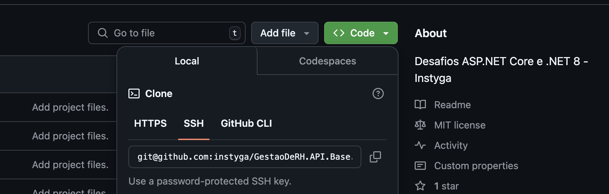

# Sistema de Gestão de RH

## Introdução

Este sistema de gestão de recursos humanos oferece funcionalidades para controle de ponto, gerenciamento de folha de pagamento, sistema de notificações, cadastro de colaboradores e um módulo de recrutamento. A arquitetura do sistema é baseada em uma abordagem em camadas:

### Camada API
Responsável por expor os endpoints da aplicação, contendo os controllers que recebem as requisições HTTP.

### Camada Domain
Contém as entidades de negócio e interfaces, encapsulando a lógica central do domínio.

### Camada Application
Implementa os casos de uso da aplicação, orquestrando a interação entre a camada de domínio e outras partes do sistema.

### Camada Infrastructure
Garante a configuração da persistência de dados, implementando repositórios e acessos ao banco de dados, utilizando Entity Framework Core.

### Camada Tests
Contém testes automatizados para garantir a qualidade e a integridade das funcionalidades do sistema.

## Requisitos

Certifique-se de que os seguintes requisitos estão instalados em seu ambiente:

- [.NET 8 SDK](https://dotnet.microsoft.com/pt-br/download/dotnet/8.0)
- [Entity Framework Core](https://docs.microsoft.com/ef/core/)
- [Docker](https://www.docker.com/products/docker-desktop/)
- [SqLite](https://learn.microsoft.com/en-us/dotnet/standard/data/sqlite/?tabs=net-cli)
- IDE (Visual Studio, VS Code, Rider, etc.)

## Como rodar

1. **Clone o repositório:**

Substitua `nome-do-repositorio` pelo nome do seu repositório
```bash
git clone https://github.com/seu-usuario/nome-do-repositorio.git
cd nome-do-repositorio
```
👍🏻 Este comando pode ser copiado através da página do repositório.



2. **Restaurar pacotes NuGet:**

No diretório do projeto, execute:
```bash
dotnet restore
```

3. **Criar o banco de dados:**

No diretório do `GestaoDeRh.Infrastructure`, execute:
```bash
dotnet ef database update
```

4. **Rodar a aplicação:**

No diretório do `GestaoDeRh.API`, execute:
```bash
dotnet run build
```

5. **Acessar a documentação:**

Quando a aplicação estiver rodando, acessar a URL [http://localhost:5086/swagger](http://localhost:5086/swagger/index.html)